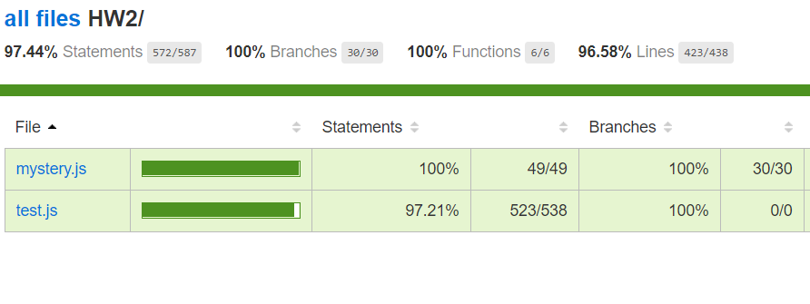

# HW2
test-file: [subject.js](subject.js)
### Steps:
(**nodejs9, git** and **python** should already be installed in your machine.The below steps are tested on Ubuntu 16.04 machine.)
- `git clone https://github.ncsu.edu/nsakhal/HW2.git`
- `cd HW2`
- `npm install`
- `npm install istanbul -G`
- `node main.js`
- `node_modules/.bin/istanbul cover test.js`
- `open coverage/lcov-report/HW2/subject.js.html` --> To open the coverage report of [subject.js](subject.js) file on web browser. 

### Screenshots of 100% coverage for subject.js file
#### subject.js coverage report on web browser

#### subject.js and test.js coverage report

#### subject.js coverage report on terminal

#### mystery.js coverage report on web browser

#### mystery.js and test.js coverage report

#### mystery.js coverage report on terminal

